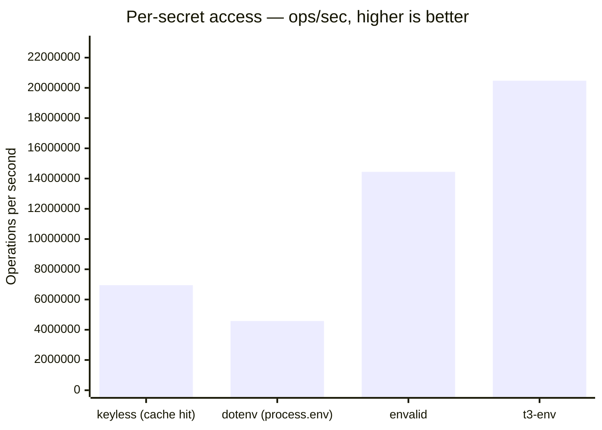
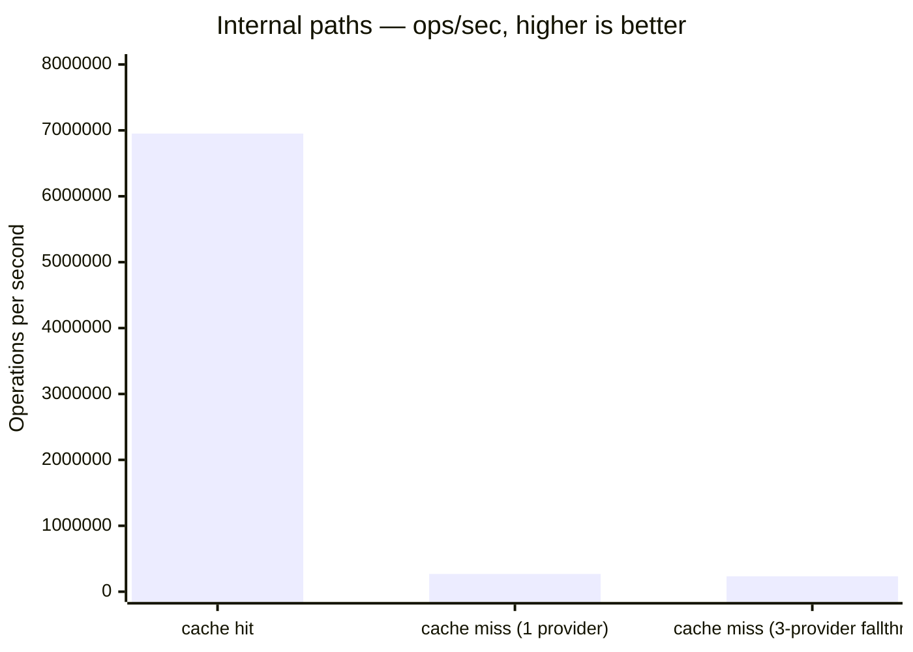

<!--
AUTO-GENERATED — do not edit by hand.
Run `pnpm bench:report` to refresh.
Last generated: 2026-04-18T08:13:13.762Z
-->

# Benchmarks

Per-access cost of looking up a validated secret in a hot path, measured with
[tinybench](https://github.com/tinylibs/tinybench). Each benchmark runs for
~1s of measurement time after warmup. Numbers are operations per second
(higher is better) and nanoseconds per operation (lower is better).

> **Caveat:** Keyless returns a `Promise` for every access because it has to
> support remote providers (GCP/AWS/Azure/Vault), automatic refresh, and
> per-key TTL. `envalid` and `@t3-oss/env-core` validate at startup and
> hand back a frozen object — subsequent access is a plain property read,
> which is naturally faster. The numbers below are honest, not flattering.

## Per-secret access (hot path)



| Library | ops/sec | ns/op | Relative |
| --- | ---: | ---: | ---: |
| keyless (cache hit) | 6.95M | 143.9 | 33.9% |
| dotenv (process.env) | 4.58M | 218.3 | 22.4% |
| envalid | 14.45M | 69.2 | 70.6% |
| t3-env | 20.48M | 48.8 | 100.0% |

**Takeaway:** Keyless cache-hit access is **~74 ns faster** than raw `process.env` here — Node's `process.env` is a getter-backed object that does string coercion on each read, so a hot in-process cache can actually beat it. Compared to startup-validated tools like `envalid` and `@t3-oss/env-core` (frozen plain objects, sync property reads), Keyless pays **~95 ns** extra per access. That's the cost of the `Promise` boundary plus cache lookup — in exchange for provider fallthrough, automatic refresh, and rotation tooling.

For HTTP request hot paths (typically thousands of accesses per second), the
delta is imperceptible — sub-microsecond per secret regardless of which tool
you pick.

## Internal paths

How Keyless behaves on its own cache vs cold-fetch paths.



| Library | ops/sec | ns/op | Relative |
| --- | ---: | ---: | ---: |
| cache hit | 6.95M | 143.9 | 100.0% |
| cache miss (1 provider) | 269.1K | 3716.4 | 3.9% |
| cache miss (3-provider fallthrough) | 233.3K | 4285.8 | 3.4% |

**Takeaway:** First fetch (cache miss) pays for schema validation and
provider iteration. Subsequent calls hit the cache and run ~26× faster.

---

### How to reproduce

```bash
pnpm install
pnpm bench:report
```

Numbers will vary by machine. The benchmarks live in
[`scripts/bench-report.ts`](./scripts/bench-report.ts).
